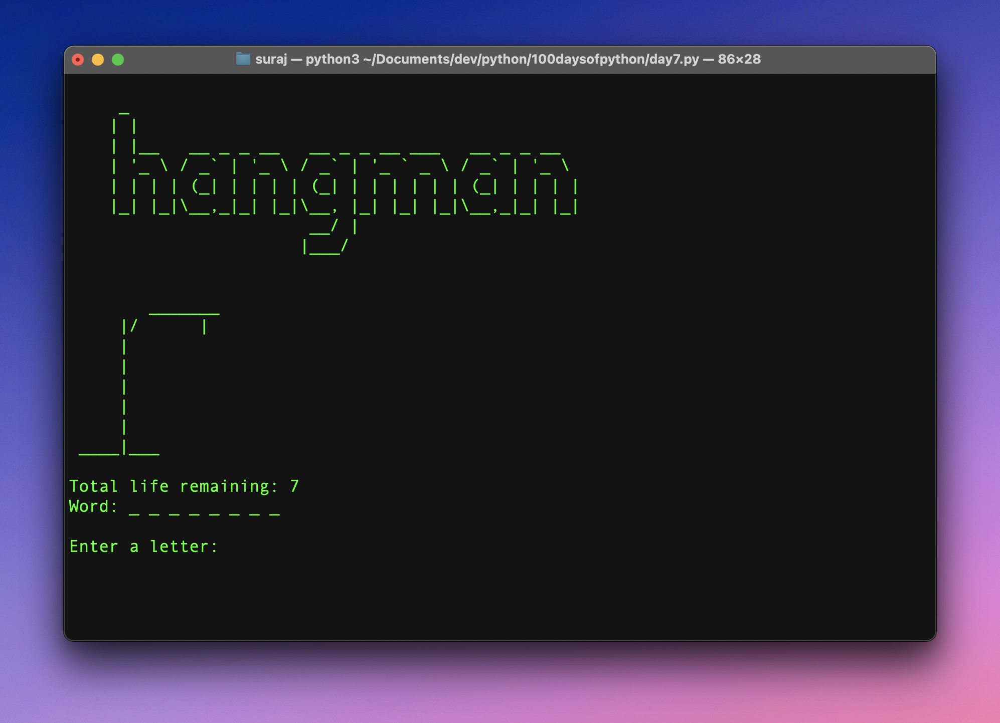

# Hangman

Hangman with ASCII art

A basic hangman game built with Python.

The game always starts with a random word chosen from a dict. You get 7 chances in total to guess the word. If you are able to guess the word, you win. Else, you lose.

After the game is over, the user is prompted for another round.

